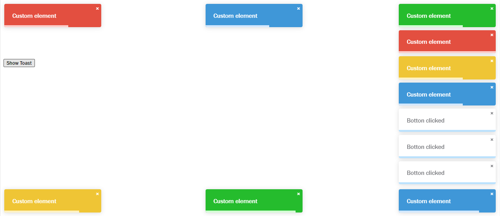

# **Toast notification library & Custom element** 
  


This is a library which provides the ability to use a custom element or to buid toast notifications
with many parameters to configurate it. 
it 's a custom element that enables drop zone to manage file.
A reusable web component.



## Usage 

### With npm
Install the package using npm or yarn

```bash
npm i  @chcodes-hamza/notifications-toast
# or
yarn add  @chcodes-hamza/notifications-toast
```

Then import it in your script

```js
import ' @chcodes-hamza/notifications-toast'
```

### With unpkg.com

```html
<script type="module" src="https://unpkg.com/@chcodes-hamza/notifications-toast"></script>
```

Then use the custom element in your html  `<toast-notifications> </toast-notifications>`.

```html
<toast-notifications options='{
      "text": "Custom element",
      "position": "top-right",
      "pauseOnHover": true,
      "pauseOnFocusLoss": true,
      "autoClose": 5000,
      "type":"sucess"
    }'></toast-notifications>
```

## Customization
### Attributes

| Attribute | Type | Description                                 |
|-----------|------|---------------------------------------------|
| options   | JSON | a JSON object that contains many properties |

#### Options Object: 

| Option       | Default          | Description                                                                                                               |
|--------------|------------------|---------------------------------------------------------------------------------------------------------------------------|
| text         | empty            | the text displayed in the toast                                                                                           |
| position     | top-right        | the postion where the toast will be displayed (top-right, top-left, top-center ,bottom-center, bottom-left , bottom-right) |
| pauseOnHover | true             | the toast progress bar stops when it s hovred                                                                             |
| pauseOnFocusLoss | true             | the toast progress bar stops when you leave the current window                                                            |
| autoClose    | 5000 ms          | the toast will be closed automaticly after the 5000ms if you wnat to make it disappear manually put it false              |
| type         | default template | customize the type of the toast (danger, info , success, warning)                                                         |
| showProgress | true             | enable the progress bar in the toast bottom                                                                               |
|  canClose | true             | give ability to close the toast                                                                                           |
|  onClose | ()=>{}           | customize the action after the toast is closed, callback as input                                                         |


### CSS Custom Properties


|  Property   |
|-----|
|  --text-color-default   |
|  --chcodes-notif-default   |
|  --chcodes-notif-default-progress   |
|   --chcodes-notif-info  |
|   --chcodes-notif-info-progress  |
|  --chcodes-notif-danger   |
|  --chcodes-notif-danger-progress   |
| --chcodes-notif-warning  |
| --chcodes-notif-warning-progress  |
| --chcodes-notif-sucess  |
| --chcodes-notif-sucess-progress  |


